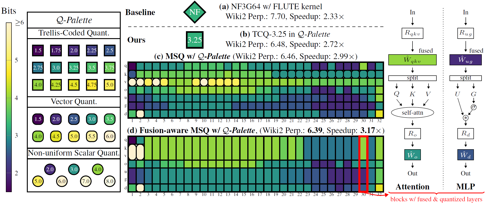

# Q-Palette

This repository contains code necessary to reproduce the experimental results presented in [our paper](https://arxiv.org/abs/2509.20214).

## News
- **Sep, 2025**: Q-Palette is accepted to **NeurIPS 2025**.

## Overview



We introduce *Q-Palette*, a versatile collection of fractional-bit quantizers that range from trellis-coded quantizers offering near-optimal distortion to simpler vector and scalar quantizers optimized for faster inference, all efficiently implemented with optimized CUDA kernels across various bitwidths. Built on Q-Palette, we propose a novel mixed-scheme quantization (MSQ) framework, *fusion-aware MSQ*, that jointly optimizes quantizer selection and layer fusion.

## Machine Information
We provide our machine information below for reference to facilitate reproduction.
- GPU: NVIDIA RTX4090 GPU
- CPU: AMD EPYC 7B13 64-Core Processor
- OS: Ubuntu 22.04.5
- CUDA Version: 12.4

## Setup

1. **Initialize environment and install CUDA kernels:**

   Navigate to `kernels/` and follow the instructions in the `README.md` file there. This step sets up the conda environment `qpal` and installs the optimized CUDA kernels for Q-Palette.

2. **Install Python dependencies:**

   Return to the current directory and run:

   ```bash
   pip install -r requirements.txt
   ```

## Usage

### Memory-Constrained Mixed-Scheme Quantization

Example usage:

```bash
python solve_mem_const.py --model meta-llama/Llama-3.1-8B --target_bitwidth 3.25
```

* `--model`: Hugging Face model name or path
* `--target_bitwidth`: Target average bitwidth for memory constraint

The resulting quantization configuration is stored at:

```
codes/msq_results/3_8b/mem_constrained/default/3.25bit.pt
```

Evaluate the resulting model's perplexity on WikiText2 (takes about 1–2 hours):

```bash
python eval_qdict.py --qdict_path msq_results/3_8b/mem_constrained/default/3.25bit.pt
```

Expected perplexity: \~6.10

### Latency-Constrained Mixed-Scheme Quantization (MSQ)

Example usage:

```bash
python solve_lat_const.py --target_thp 200 
```

* `--target_thp`: Target throughput (tokens/sec) at batch size=1 on an RTX 4090 GPU.
* `--use_cc`: Flag that enables CUDA-Core implementation (optional).
* `--no_fuse`: Flag that disables fusion-aware MSQ.

The resulting configurations are quickly saved at:

```
codes/msq_results/3_8b/lat_constrained/4090_cc/default_err/200.0thp.pt
codes/msq_results/3_8b/lat_constrained/4090_cc/default_err/200.0thp_merge_info.pt
```

Evaluate WikiText2 perplexity (about 1–2 hours):

```bash
python eval_qdict.py --qdict_path msq_results/3_8b/lat_constrained/4090_cc/default_err/200.0thp.pt
```

Expected perplexity: \~6.37

Evaluate throughput:

```bash
python eval/measure_latency_merge_simt.py \
    --hf_path meta-llama/Llama-3.1-8B \
    --qdict_path msq_results/3_8b/lat_constrained/4090_cc/default_err/200.0thp.pt \
    --use_inc_mlp --use_inc_attn \
    --merge_info_path msq_results/3_8b/lat_constrained/4090_cc/default_err/200.0thp_merge_info.pt \
    --print_result
```
(You may need to modify PYTHONPATH to contain this codebase, i.e., `export PYTHONPATH=./:$PYTHONPATH`)

Expected throughput: \~190–200 tokens/sec (RTX 4090 GPU)

## Commands for reproducing Figure 1 results

### Figure 1 (b): Single-Scheme Quantization with TCQ-3.25

Evaluate perplexity:

```bash
python eval_qdict.py --quantizer_str tcomb_6_7_0.5_none_0.9
```

Evaluate throughput:

```bash
python eval/measure_latency.py \
    --hf_path meta-llama/Llama-3.1-8B \
    --quantizer_str tcomb_6_7_0.5_none_0.9 \
    --use_inc_mlp --use_inc_attn --print_result
```

### Figure 1 (c): Latency-Aware MSQ without Fusion
We provide the exact quantization configuration we used for figure 1 (c) in this codebase as follows:

Evaluate perplexity:

```bash
python eval_qdict.py --qdict_path msq_results/figure1c/0.0_8.0bit_1.11.pt
```

Evaluate throughput:

```bash
python eval/measure_latency_merge_simt.py \
    --hf_path meta-llama/Llama-3.1-8B \
    --qdict_path msq_results/figure1c/0.0_8.0bit_1.11.pt \
    --use_inc_mlp --use_inc_attn \
    --merge_info_path msq_results/figure1c/0.0_8.0bit_1.11_merge_info.pt \
    --print_result
```

### Figure 1 (d): Latency-Aware MSQ with Fusion
We provide the exact quantization configuration we used for figure 1 (d) in this codebase as follows:

Evaluate perplexity:

```bash
python eval_qdict.py --qdict_path msq_results/figure1d/0.0_8.0bit_1.17.pt
```

Evaluate throughput:

```bash
python eval/measure_latency_merge_simt.py \
    --hf_path meta-llama/Llama-3.1-8B \
    --qdict_path msq_results/figure1d/0.0_8.0bit_1.17.pt \
    --use_inc_mlp --use_inc_attn \
    --merge_info_path msq_results/figure1d/0.0_8.0bit_1.17_merge_info.pt \
    --print_result
```

## Planned Updates
The current release provides a minimal implementation to reproduce the main results of the paper.  

Planned updates include:
- Release code for loss and cost term computation
- Add tutorials and usage examples for practitioners
- Broader model, kernel, and usability support
- Setup support with `uv`
- Upload HuggingFace checkpoints for some key results

Stay tuned!

## Citation
```
@inproceedings{lee2025qpalette,
      title={Q-Palette: Fractional-Bit Quantizers Toward Optimal Bit Allocation for Efficient LLM Deployment}, 
      author={Deokjae Lee and Hyun Oh Song},
      booktitle = {Advances in Neural Information Processing Systems},
      year={2025},
}
```
